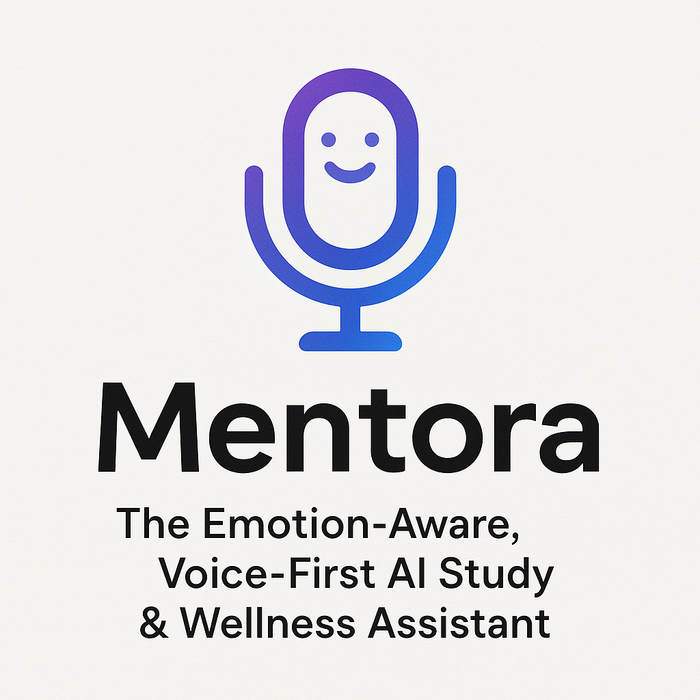

# Mentora Branding & Logo

Mentora features a custom logo that reflects its mission as an emotion-aware, voice-first AI study and wellness assistant.

## Official Logo

The logo features a friendly, smiling face within a microphone shape, using a modern blue-purple gradient. It represents Mentora’s focus on voice-first interaction and positive, supportive engagement.

## Logo Usage

- The Mentora homepage uses a text-based logo for a clean and minimal look.
- The official logo is available for branding, marketing, documentation, and other uses.

## Icons

- The UI uses standard icons from UI libraries or frameworks as needed.